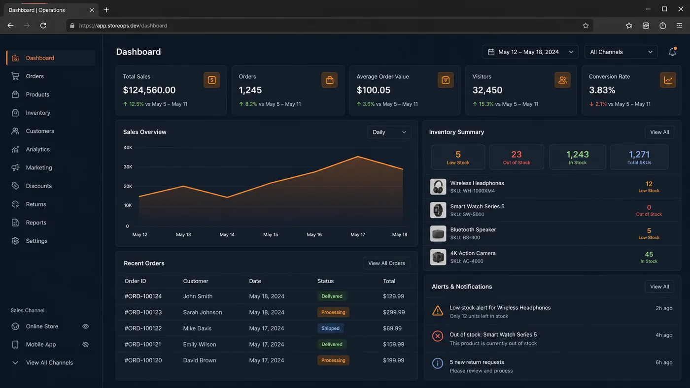
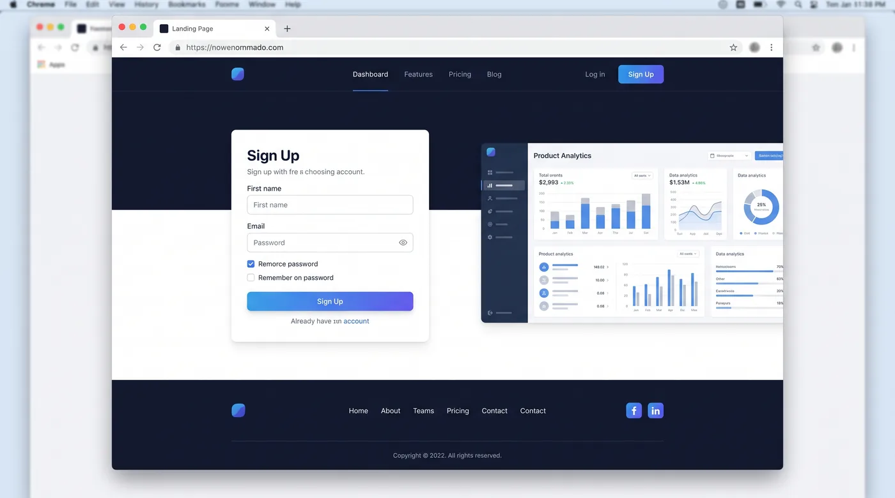
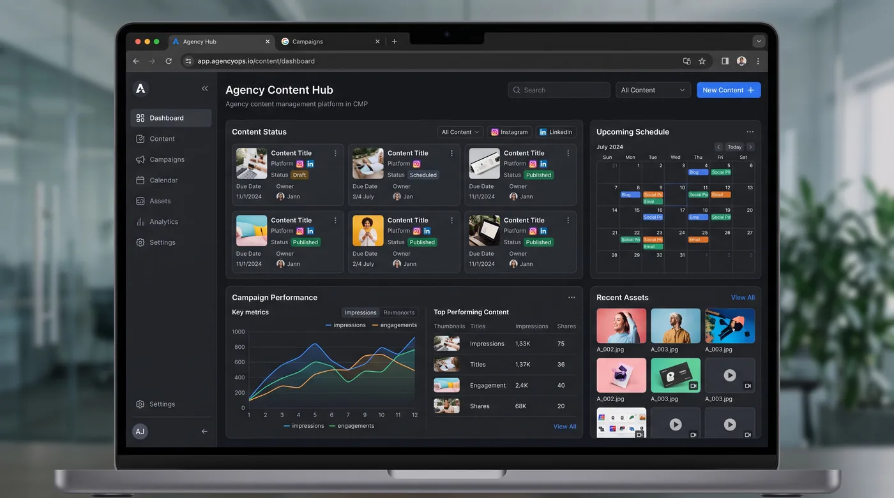
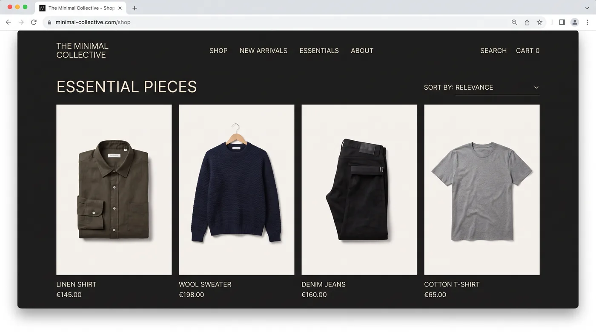
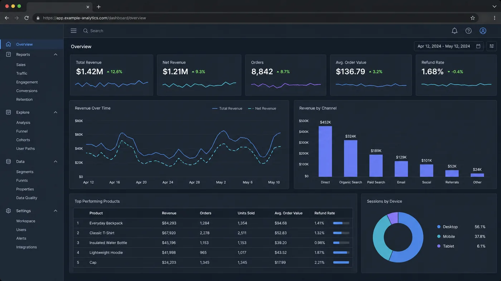

# Jahanzaib Ali — Full-Stack Developer Portfolio

Personal portfolio website for **Jahanzaib Ali**, a Full-Stack Developer specializing in Next.js, WordPress, TypeScript, conversion-focused landing pages, and performance optimization.

**Live website:** [jahanzaib-ali-portfolio-three.vercel.app](https://jahanzaib-ali-portfolio-three.vercel.app)

<p align="center">
  
</p>

## About

I design and build fast, accessible websites and web applications that help businesses turn visitors into enquiries, sign-ups, and sales. My work includes Next.js applications, WordPress and Elementor websites, REST API integrations, dashboards, and technical SEO improvements.

## Services

- Full-Stack Development — Next.js apps, dashboards, and CMS-backed systems
- Frontend Development — React and TypeScript interfaces
- Backend & API Integration — REST APIs, Supabase, and data layers
- WordPress Development — Elementor, speed, SEO, and content management
- CRO Landing Pages — paid-traffic and lead-generation pages
- Performance Optimization — Core Web Vitals and technical SEO

## Project Concepts

The following are illustrative project concepts and interface visuals. They are not documented client projects.

| Project | Preview |
| --- | --- |
| Northgate Commerce Dashboard |  |
| Aurelio Studio Rebuild |  |
| Vantor Leads Landing System |  |
| Fieldpost Agency Platform |  |
| Marloe Apparel Storefront |  |
| Kestrel Analytics Suite |  |

## Tech Stack

Next.js, React, TypeScript, Tailwind CSS, Framer Motion, tsParticles, Swiper, Resend, and Google reCAPTCHA v3.

## Run Locally

```bash
npm install
npm run dev
```

Open [http://localhost:3000](http://localhost:3000).

## Contact

- Email: [juttbroo1122@gmail.com](mailto:juttbroo1122@gmail.com)
- LinkedIn: [Jahanzaib Ali](https://www.linkedin.com/in/jahanzaib-ali-5b7170300/)
- Facebook: [jahanzaibaliwp](https://www.facebook.com/jahanzaibaliwp)
- WhatsApp: [+92 322 7483975](https://wa.me/923227483975)

© 2026 Jahanzaib Ali. All rights reserved.
